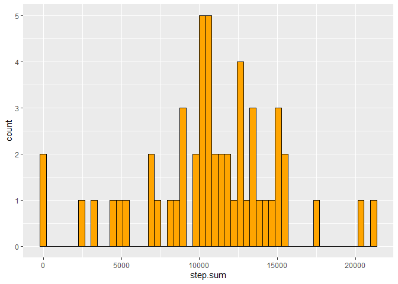

###Loading and preprocessing the data
#### 1.  Loading packages:

```r
library(dplyr)
library(lubridate)
library(ggplot2)
```

#### 2.  Loading Data: 

```r
### Load the data
ds <- read.csv("activity.csv")
ds <- na.omit(ds)
```
### What is mean total number of steps taken per day?

#### 1. Calculating the total number of steps taken per day:

```r
activity <- ds %>%
        mutate(date = ymd(date)) %>%
        group_by(date) %>%
        summarise(step.sum = sum(steps))

activity
```

```
## # A tibble: 53 x 2
##    date       step.sum
##    <date>        <int>
##  1 2012-10-02      126
##  2 2012-10-03    11352
##  3 2012-10-04    12116
##  4 2012-10-05    13294
##  5 2012-10-06    15420
##  6 2012-10-07    11015
##  7 2012-10-09    12811
##  8 2012-10-10     9900
##  9 2012-10-11    10304
## 10 2012-10-12    17382
## # ... with 43 more rows
```

#### 2 Making histogram of the total nmuber of steps taken each day:


```r
g <- ggplot(data = activity, aes(x = step.sum))
g + geom_histogram(bins = 53, color = "black", fill = "orange")
```

<!-- -->

#### 3 Calculating and reporting the mean and the median of the total number of steps taken per day.


```r
mean(activity$step.sum)
```

```
## [1] 10766.19
```

```r
median(activity$step.sum)
```

```
## [1] 10765
```
### What is the average daily activity pattern?

#### 1. Making a time series plot:
5-min intervals and the average number of steps taken, averaged across all days. I have also made an annotation to show the interval that contains the maximum number of steps. 

```r
interval.data <- ds %>%
        group_by(interval) %>%
        summarise(steps = mean(steps))

g <- ggplot(data = interval.data, aes(x=interval, y=steps))
g + geom_line(color = "firebrick") +
        geom_polygon() +
        annotate("text", x = 835, y = 220, label = "Steps: 206, Interval: 835")
```

<!-- -->

###Imputing missing values

#### 1. Reporting number of missing values in data:

```r
# 1.  How many NA values in data?: 
data.na <- read.csv("activity.csv")
nas <- is.na(data.na$steps)
length(which(nas==TRUE))
```

```
## [1] 2304
```

#### 2 & 3. filling new dataset with missing values.
NA values are here replaced with its interval mean.

```r
# 2. create new dataset with tapply:
mean.interval <- with(data.na, tapply(steps, interval, mean, na.rm=TRUE, simplify=TRUE))
data.na$steps[nas] <- mean.interval[as.character(data.na$interval[nas])]

activity.2 <- data.na %>%
        mutate(date = ymd(date)) %>%
        group_by(date) %>%
        summarise(step.sum = sum(steps))
```

#### 4. Making histogram of total number of steps taken each day:


```r
g <- ggplot(data = activity.2, aes(x = step.sum))
g + geom_histogram(bins = 53, color = "black", fill = "orange")
```

<!-- -->

#### 5. Does the mean and median differ significantly after filling in missing values?

The new mean and medians are:

```r
mean(activity.2$step.sum)
```

```
## [1] 10766.19
```

```r
median(activity.2$step.sum)
```

```
## [1] 10766.19
```

While the difference between old and new values are: 

```r
mean(activity.2$step.sum) - mean(activity$step.sum)
```

```
## [1] 0
```

```r
median(activity.2$step.sum) - median(activity$step.sum)
```

```
## [1] 1.188679
```
We see that the mean hasn't changed at all, while the median is now a bit higher.
The impact of imputing missing data in this case will make the total count of steps taken bigger. 
It might be better to leave these out since we don't know what caused the NAs.

### Are there differences in activity patterns between weekdays and weekends?

#### 1. Create a new factor variable in the dataset (data.na) with two levels - "weekday" and "weekend"


```r
# creating new factor: 


weekday <- c("Monday","Tuesday","Wednesday","Thursday","Friday")
weekend <- c("Saturday","Sunday")

data.na <- data.na %>%
        mutate(date = ymd(date)) %>%
        mutate(daytype = weekdays(date(data.na$date)))

data.na$daytype[which(data.na$daytype %in% weekday)] <- "weekday"
data.na$daytype[which(data.na$daytype %in% weekend)] <- "weekend"
data.na$daytype <- as.factor(data.na$daytype)
```

#### 2. Panel Plot
5 minute interval and the average number of steps taken, averaged across all weekday- and weekend days. 


```r
# making plot : 

interval.data.2 <- data.na %>%
        group_by(daytype, interval) %>%
        summarise(steps = mean(steps))

g <- ggplot(data = interval.data.2, aes(x=interval, y=steps))
g + geom_line(color = "firebrick") +
        facet_grid(interval.data.2$daytype~.)
```

<!-- -->

